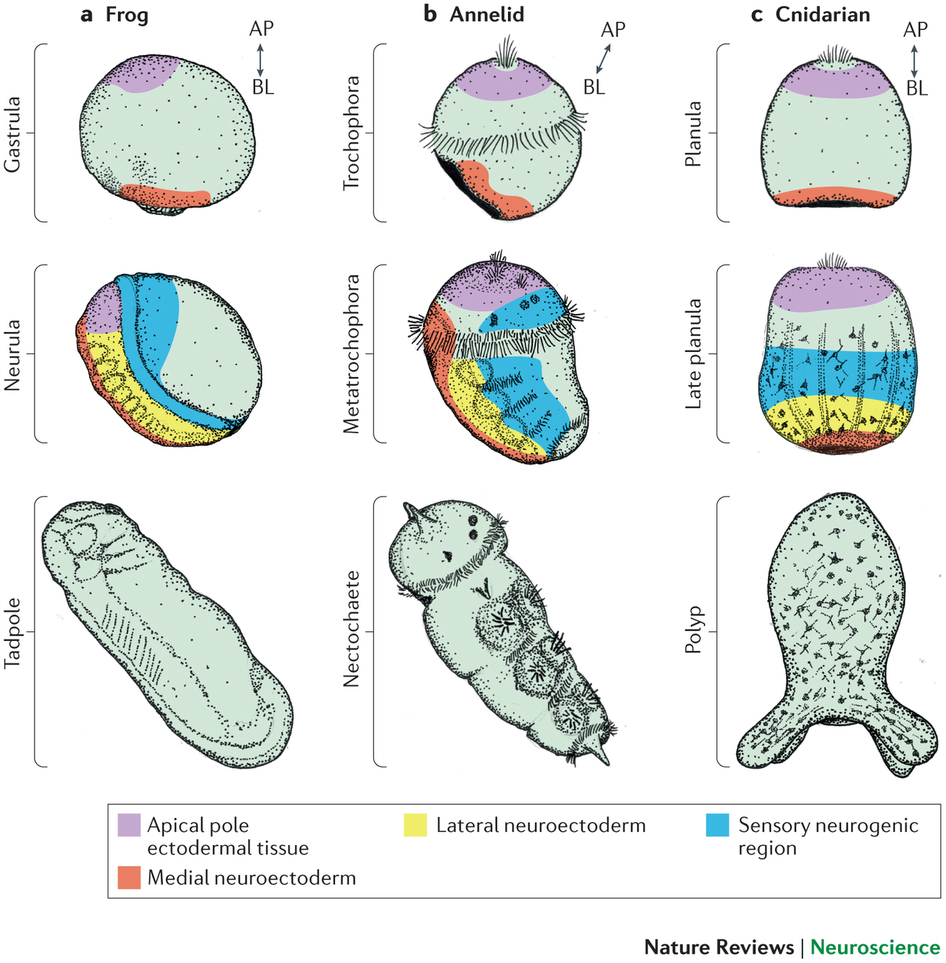

```{r setup, include=FALSE}
knitr::opts_chunk$set(echo = FALSE)
library(tidyverse)
library(ggplot2)
```

# Prelude

---

<iframe width="800" height="500" src="https://www.youtube.com/embed/JB7jSFeVz1U?rel=0" frameborder="0" allow="autoplay; encrypted-media" allowfullscreen></iframe>

<!-- Ode to the Brain -->

# Preliminaries

---


</br>


</br>


<!-- Funding sources with icons -->

---


</br>


# The Frontier Within

## Core questions for science

>1. How did the Universe begin?
>2. What is the origin of life?
>3. What is the nature of mind?

---

<div class="centered">


## Psychology is harder than physics

---

<div class="centered">

</div>

---

<div class="centered">

</div>

## Why is it so hard?

---

<div class="centered">

</div>

---

<div class="centered">

</div>

---

<div class="centered">

</div>
<!-- Blind men and the elephant -->

---

<div class="centered">

</div>

<!-- Birds eye view -->

# What must the nervous system do?

---


<small>Powers 1973</small>

## Control internal states

<div class="centered">

</div>

<!-- Bart Simpson negative feedback loops -->

## Control external states (behavior)


<!-- Preserve, protect, defend... -->

---


<!-- Eat, drink, & be merry... -->

## Be fruitful & multiply...

---


<!-- Be fruitful & multiply... -->

---

- Defense
- Ingestion
- Reproduction

## What *specific* behaviors?

---

- Perception (what is it/where is it?)
- Locomotion
- Object manipulation/consumption
- Signaling/communication

## How is the nervous system organized to shape these behaviors?

---

<div class="centered">
<a href="http://larrywswanson.com/wp-content/uploads/2015/06/4-systems-network.jpg">
</a>

<small>[Swanson 2005](http://larrywswanson.com/wp-content/uploads/2015/06/4-systems-network.jpg)</small>
</div>

---

<div class="centered">
<a href="http://larrywswanson.com/wp-content/uploads/2015/06/Willis-on-Steno-circuit.jpg">
</a>

<small>[Swanson 2005](http://larrywswanson.com/wp-content/uploads/2015/06/4-systems-network.jpg)</small>
</div>

---

<div class="centered">
<a href="http://larrywswanson.com/wp-content/uploads/2015/06/Cajal-1893-Reflex.jpg">
</a>
</div>

## Perception -> Cognition -> Action

---

- What's out there?
- Where is it?
- How am I feeling now?
- What happened in the past?
- ...
- What should I do about it?

---


<small>[Fuster 2004](http://doi.org/10.1016/j.tics.2004.02.004)</small>

---

## Spatial & temporal scales

---

<div class="centered">
<a href="http://www.nature.com/neuro/journal/v17/n11/images/nn.3839-F1.jpg">

</a>

<small>[Sejnowski 2014](http://doi.org/10.1038/nn.3839)</small>
</div>

---

> "*If understanding everything you needed to know about the brain is a mile, how far have we walked?*"

---

<iframe width="800" height="450" src="https://www.youtube.com/embed/nvXuq9jRWKE" frameborder="0" allow="autoplay; encrypted-media" allowfullscreen></iframe>

<small>J. Lichtman</small>
<!-- <https://www.youtube.com/watch?v=nvXuq9jRWKE&feature=youtu.be> -->

# Inching along...

---


<!-- Egyptian mummy -->

## The mind as machine...

---

<div class="centered">
<a href="http://www.unmuseum.org/notescurator/automata_duck.jpg">

</a>

<!-- Automata -->

---


<small>Descartes 1662</small>

---


<!-- Switchboard -->

---

<div class="centered">

</div>

---

<div class="centered">

</div>

<small>Powers 1973</small>
<!-- Thermostat/feedback system -->

---


<!-- Computer -->

---


<!-- Cell phone -->

---


<small><https://www.submarinecablemap.com/></small>

---

- Inputs & outputs
- Connectivity & communication
- Information processing & computation
- Functionally specialized components

# Learning some of the parts

---

<iframe width="800" height="500" src="https://www.youtube.com/embed/snO68aJTOpM?rel=0" frameborder="0" allow="autoplay; encrypted-media" allowfullscreen></iframe>

## Brain anatomy through dance

<div class="centered">
<audio controls>
  <source src="snd/brain_boxing-2.m4a">
</audio>
</div>

## Finding our way around

### **Anterior/Posterior**
### **Medial/Lateral**
### **Superior/Inferior**
### **Dorsal/Ventral**
### **Rostral/Caudal**

---

<div class="centered">


<!-- <https://upload.wikimedia.org/wikipedia/commons/thumb/e/e7/Blausen_0019_AnatomicalDirectionalReferences.png/800px-Blausen_0019_AnatomicalDirectionalReferences.png> -->
</div>

## The parts have special functions

## The "4 Fs"

- Fighting
- Fleeing
- Feeding
- Mating

---


<!-- Hypothalamus -->

# Nuts & bolts...

## Cells of the nervous system

## Glial ("glue") cells

<div class="centered">
<a href="https://upload.wikimedia.org/wikipedia/commons/5/56/Human_astrocyte.png">

</a>
</div>

---

<div class="centered">
<a href="https://upload.wikimedia.org/wikipedia/commons/thumb/8/8a/Oligodendendrocytes_in_rat_brain.tif/lossy-page1-800px-Oligodendendrocytes_in_rat_brain.tif.jpg">

</a>
</div>

## Neurons

<div class="centered">
<a href="http://www.extremetech.com/wp-content/uploads/2012/03/a-mouse-hippocampus-640x353.jpg">

</a>
</div>

<!-- Mouse hippocampus -->

---

<div class="centered">

</a>
</div>

<small>[Shen 2015](https://www.scientificamerican.com/article/does-the-adult-brain-really-grow-new-neurons/)</small>

---


[Greg Dunn Designs](http://www.gregadunn.com)

## Fun facts about [neurons](https://en.wikipedia.org/wiki/Neuron)

- Most [born early in life](http://www.ninds.nih.gov/disorders/brain_basics/ninds_neuron.htm)
- Post-mitotic -- don't divide
- Among longest-lived cells in body

---

- Can extend over long distances
- Specialized for electrical & chemical communication

---

<div class="centered">

</div>

<!-- Schematic neuron showing information flow -->

---

<iframe width="800" height="500" src="https://www.youtube.com/embed/H0K2dvB-7WY?rel=0" frameborder="0" allow="autoplay; encrypted-media" allowfullscreen></iframe>

## Neurons release neurotransmitters

---

<div class="centered">

</div>

## Monoamine Song

<iframe width="560" height="315" src="https://www.youtube.com/embed/gsjcb7w1Y-w" frameborder="0" allow="accelerometer; autoplay; encrypted-media; gyroscope; picture-in-picture" allowfullscreen></iframe>

<small><https://www.youtube.com/watch?v=gsjcb7w1Y-w></small>
<small><https://en.wikipedia.org/wiki/Mah_Nà_Mah_Nà></small>

---

Monoamines, do-do do do-do</br>
Monoamines, do do do-do</br>
Monoamines, do do do do-do do do-do do do-do do do do do-do do

---

Monoamines, do-pa-mine is one</br>
Monoamines, norepi, too</br>
Monoamines, sero-tonin e-pinephrine, dop-a- mine, nor-epinephrine, melatonin, whoo!

---

Monoamines, mod-u-late neurons </br>
Monoamines, throughout the brain</br>
Monoamines, keep people happy, brains snappy, not sleepy, not sappy, do-do do-do do-do do

---

- Nicotine
- Alcohol
- Valium
- Prozac
- Opioids
- Marijuana

## Substances of use and abuse often mimic or alter neurotransmitters

# How did it get here?

---

<div class="centered">

</div>

---

<div class="centered">
<a href="http://www.zo.utexas.edu/faculty/sjasper/images/26.2.gif">

</a>
</div>

---

<div class="centered">
<a href="http://www.indiana.edu/~geol105b/images/gaia_chapter_6/time_scale.gif">

</a>
</div>

## The Cambrian explosion


## Behavior requires...

- Energy
- Perception at a distance
- Action

## Action requires...

- Perception
- Problem solving
- Sequence planning
- Current state + stored information (memory)

## Evolving brains

---

<div class="centered">


<small>[Arendt 2016](http://doi.org/10.1038/nrn.2015.15)</small>
</div>

---

<div class="centered">


<small>[Arendt 2016](http://doi.org/10.1038/nrn.2015.15)</small>
</div>

---

<div class="centered">
<a href="http://icb.oxfordjournals.org/content/42/4/743/F2.large.jpg">

</a>

<small>(Northcutt 2002)</small>
</div>

---

<div class="centered">
<a href="http://icb.oxfordjournals.org/content/42/4/743/F2.large.jpg">

</a>

<small>(Northcutt 2002)</small>
</div>

---

<div class="centered">
<a href="http://neurosciencelibrary.org/evolution/paleo/images/BrnBodwt6.jpg">

</a>
</div>

## Does size matter? 

---


---

| Species | # cortical neurons | cortical mass (g) |
|---------|--------------------|-------------------|
| Human   | 16 B               | 1233              |
| Chimpanzee | 6 B             | 286               |
| Elephant | 5.6 B             | 2800              |
| Baboon | 2.9 B               | 120.2             |

---

```{r, echo=FALSE, message=FALSE, warning=FALSE, error=FALSE}
brain <- data.frame(species = c('human', 'chimpanzee', 'elephant', 'baboon'),
                    neurons = c(16, 6, 5.6, 2.9),
                    mass = c(1233, 286, 2800, 120.2))

brain %>% 
  ggplot(.) +
  aes(x = neurons, y = mass, color = species) +
  geom_point(size = 4) +
  xlab("Billions of cortical neurons") +
  ylab("Mass (g)")
  theme(axis.text = element_text(size = 24),
        legend.text = element_text(size = 24),
        legend.title = element_text(size = 24),
        axis.title = element_text(size = 36))
```

---

> "*...our brain outranks that of other animals not because we are an exception in evolution, but rather because...we hold the largest number of neurons in the cerebral cortex...*"

<small>Herculano-Houtzel 2016</small>

---


## Developing brains

---

<!-- ## Neurulation -->

<div class="centered">
<a href="http://thebrain.mcgill.ca/flash/i/i_09/i_09_cr/i_09_cr_dev/i_09_cr_dev_2a.jpg">

</a>
</div>

---

<p><a href="https://commons.wikimedia.org/wiki/File:Spina-bifida.jpg#/media/File:Spina-bifida.jpg"></a></p>

<!-- Spina bifida -->

---

<div class="centered">
<a href="https://rawgit.com/psu-psychology/psy-511-scan-fdns/master/lectures/img/radial-glia.jpg">

</a>
</div>

<!-- Migration from ventricular zone -->

---

<iframe width="666" height="500" src="https://www.youtube.com/embed/ZRF-gKZHINk" frameborder="0" allowfullscreen></iframe>

---

<iframe width="666" height="500" src="https://www.youtube.com/embed/t-8bxeWqSV4" frameborder="0" allowfullscreen></iframe>

---

<!-- ## Axon growth cone -->

<iframe width="666" height="500" src="https://www.youtube.com/embed/Fgmt2RBow0I" frameborder="0" allowfullscreen></iframe>

---


<div class="centered">

</div>

<!-- ## Synaptogenesis -->

---

<div class="centered">

</div>

<!-- ## Postnatal patterns of synaptogenesis -->

---

<iframe width="666" height="500" src="https://www.youtube.com/embed/atLQVgUwnrY" frameborder="0" allowfullscreen></iframe>

<!-- Myelination/DTI -->

---

<div class="centered">


<small>[Baumann 200](http://dx.doi.org/10.1152/physrev.2001.81.2.871)</small>
</div>

<!-- Myelination patterns -->

---

- Extended post-natal development
- Proliferation then pruning

---


<!-- The Evolution of Childhood -->

# Where is neuroscience going?

---

<div class="centered">

</br>
<small>
[Baker 2016](http://doi.org/10.1038/533452a)
</small>
</div>

<div class="notes">
Nature conducted a survey of some 1,600 scientists in 2016. They were asked this question and a few others. Here are the results.
</div>

---

<div class="centered">

</div>

---

<div class="centered">


<small>[Szucs & Ioannides 2017](http://doi.org/10.1371/journal.pbio.2000797)</small>
</div>

<div class="notes">
As Szucs and Ioannides have shown based on an analysis of more than 10,000 papers in the cognitive neuroscience literature, sample sizes are small, and the probability of false negatives is high, especially for small to medium effect sizes.
</div>

---

<div class="centered">
> "Assuming a realistic range of prior probabilities for null hypotheses, false report probability is likely to exceed 50% for the whole literature."

<small>[Szucs & Ioannides 2017](http://doi.org/10.1371/journal.pbio.2000797)</small>
</div>

<div class="notes">
So, this means that we may not know what we think we know.
</div>

## On the other hand...


---


<http://openneuro.org>

---

<video width="1000" data-autoplay>
  <source src="mov/neurosynth-happy.mp4" type="video/mp4">
Your browser does not support the video tag.
</video>
</br>
<http://neurosynth.org>

---

<iframe width="800" height="500" src="https://www.youtube.com/embed/zKyO_AB7aMc" frameborder="0" allow="autoplay; encrypted-media" allowfullscreen></iframe>

<http://humanconnectome.org>

---


[imaging.psu.edu](http://imaging.psu.edu)

---

<iframe width="850" height="500" src="https://www.youtube.com/embed/og_1dZc1i_w" frameborder="0" allow="autoplay; encrypted-media" allowfullscreen></iframe>

<!-- CLARITY technique -->

---

<iframe width="850" height="500" src="https://www.youtube.com/embed/FlGbznBmx8M" frameborder="0" allow="autoplay; encrypted-media" allowfullscreen></iframe>

<!-- Optogenetics -->

---

<iframe width="800" height="500" src="https://www.youtube.com/embed/KDjWdtDyz5I" frameborder="0" allowfullscreen></iframe>

<div class="notes">
Effects of DBS for Parkinson's.
</div>

---


<!-- Convolutional neural networks -->

---


<!-- Gut brain/connection -->

# The frontier within...

---

<div class="centered">
<a href="http://www.nature.com/neuro/journal/v17/n11/images/nn.3839-F1.jpg">

</a>

<small>[Sejnowski 2014](http://doi.org/10.1038/nn.3839)</small>
</div>

---

<div class="centered">
<a href="http://larrywswanson.com/wp-content/uploads/2015/06/4-systems-network.jpg">
</a>

<small>[Swanson 2005](http://larrywswanson.com/wp-content/uploads/2015/06/4-systems-network.jpg)</small>
</div>

---

<div class="centered">

</div>

<small>Krakauer 2017</small>

---

>"*Behavior is the linchpin of the most vexing problems in public health, and a better understanding of behavior is fundamental to achieving positive health outcomes, from prenatal development throughout adulthood.*"

<small>Gilmore, Adolph, & Tamis-LeMonda, 2019</small>

---

<div class="centered">
<a href="http://www.apa.org/science/about/psa/2017/10/video-data.aspx">

</a>
</div>

---

<div class="centered">
<video width="700" data-autoplay>
  <source src="https://nyu.databrary.org/slot/27087/0,79000/asset/119877/download?inline=true" type="video/mp4">
Your browser does not support the video tag.
</video>

$n=900$ 12-, 18-, 24-mo-olds; $n=30$ sites

## A human behavior-ome

<video height="600" controls data-autoplay>
  <source src="mov/Construction.mp4" type="video/mp4">
Your browser does not support the video tag.
</video>

<small>*Source*: Ori Ossmy (NYU)</small>

---


rogilmore@psu.edu</br>
<https://gilmore-lab.github.io>
